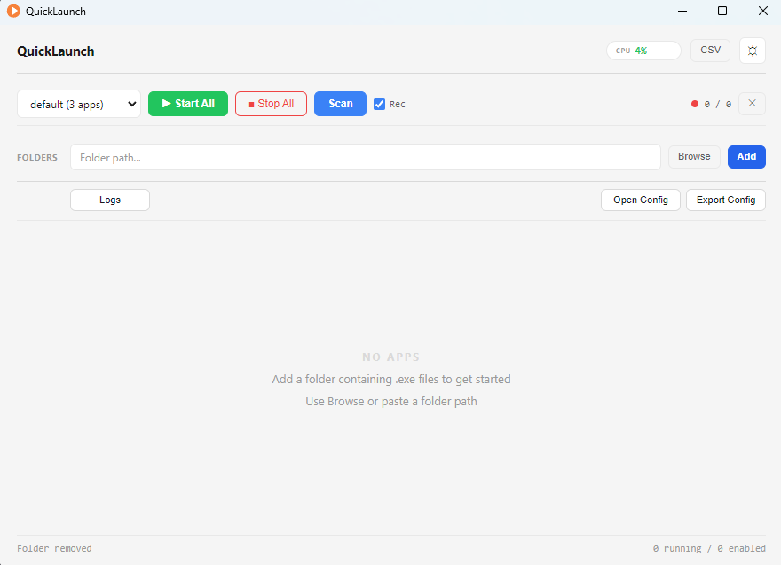

# QuickLaunch

> Lightweight Windows application launcher built with Electron



## Features

- **Scan folders** for all `.exe` files
- **Single / Batch** start & stop applications
- **Drag & drop** reorder + **delay startup** (500ms step)
- Per-app settings: **launch arguments**, custom **alias**, **admin** mode
- Real-time **CPU / Memory** per process + system CPU
- **Operation logs** (daily rotation)
- **CSV export** of performance history
- Multi **Profile** management + JSON config import/export
- Light / Dark theme
- **Minimize to tray** on close

## Quick Start

```bash
git clone https://github.com/huangthreeox/hb_quicklauch.git
cd hb_quicklauch
npm install
npm start
```

## Usage

1. Click **⚙** to open settings
2. Add folders → **Scan**
3. Edit alias, Args, Delay, Adm per app
4. **⠿ Drag** cards to reorder
5. **▶ Start All** launches in order with delay

## Tech Stack

| Layer | Tech |
|---|---|
| Framework | Electron 30 |
| UI | HTML / CSS / JavaScript |
| Monitoring | PowerShell (WMI) |
| Logging | Plain text, daily rotation |

## License

MIT
